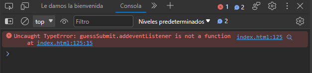
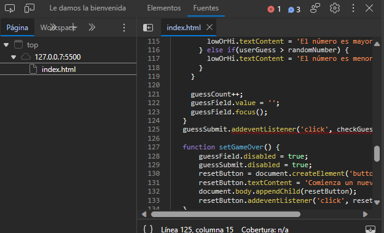
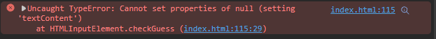
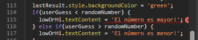
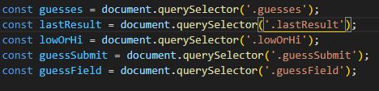
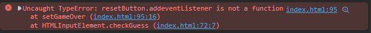
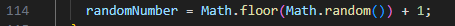
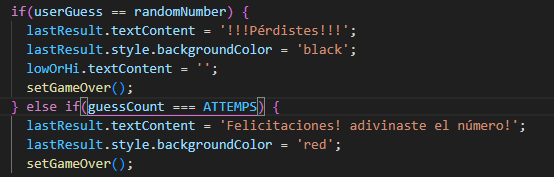
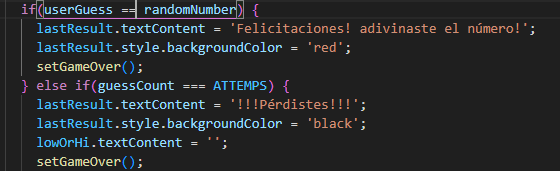
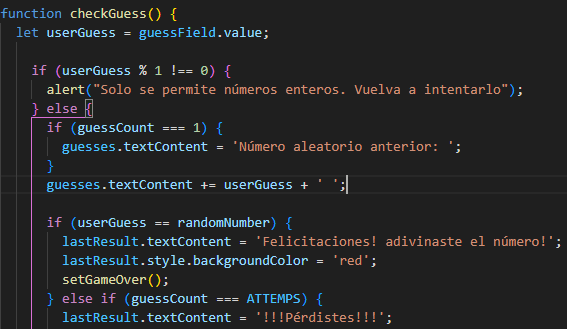

# Error 1:
Al visualizar la consola, pude observar el siguiente error:

La cual, nos indica que es un error en el código:

El error en esta línea de código es que una palabra reservada está mal escrita, se puso "addeventListener", cuando lo correcto es "addEventListener". 
**Solución:** escribir bien esta palabra reservada, ya que la letra "E" debe de estar en mayúscula.

# Error 2
Al arreglar el punto anterior, me tira el siguiente error en la consola: 

El error es porque nunca se ha definido la clase lowOrHi, ya que no se mandó a llamar de manera correcta. En el error, la línea de código aparece de la siguiente manera:   const lowOrHi = document.querySelector('lowOrHi');

**Solución:** solo es de agregar un punto antes de "lowOrhi", quedando de la siguiente manera: const lowOrHi = document.querySelector('.lowOrHi'); 

Imagen de solución:

# Error 3
Ya luego de haber solucionado los errores anteriores, ya no aparece ningún error en consola, por lo que se prueba el juego.  Cuando adivina el número, vuelve a aparecer un nuevo mensaje de error en la consola: 

El error es el mismo que el error 1, se escribió "addeventListener" en vez de "addEventListener".

**Solución:** esccibir "addEventListener".

# Error 4
El juego ya no lanza error, ni cuando adivina el número, Pero probando un rato el juego, pude notar que solo permite un número aleatorio hasta el 10. Lo cual se procede a buscar en el código el error:

**Solución:** reemplazar esa línea de código por la siguiente: let randomNumber = Math.floor(Math.random() * 100) + 1; 

# Error 5
También se encuentra otro error similar al anterior:

**Solución:** se reemplaza esa línea con: randomNumber = Math.floor(Math.random() * 100) + 1; 

# Error 6
El siguiente error es de cambiar el siguiente fragmento de código:

Esto es porque la sintaxis está al revés, en la primera condición, si se adivina el número, marcará error, todo lo contrario a lo que se requiere llegar. En la segunda condición (else if), luego de haber hecho 5 intentos, que es el valor de la variable "ATTEMPS", mostrará que se ha ganado el juego, lo cual, sea el número que sea, a la quinta vez, siempre marcará que se ha adivinado el número. 

**Solución:** la solución es de cambiar un poco la sintaxi, y lo que va en el "if" ponerlo en el "else if" y viceversa. También de cambiar la variable "ATTEMPS" por un 10, ya que se pide que el usuario tenga disponibles 10 intentos. Quedando el código de la siguiente manera:

No olvidar cambiar "ATTEMPS" a 10:

# Error 7
El programa hasta este punto funciona correctamente. Solo que cuando el usuario ingresa un número que no sea entero, no aparece un mensaje de alerta.

**Solución:** la solución es hacer una condición para saber si lo que el usuario ingresa es entero o no. A través de un if, que compare si el valor es diferente a entero y, si es así, mostrar el mensaje de que lo vuelva a intentar, sin quitarle ningún intento. Luego, en el else, tener el código que ya se tiene donde verifica si el usuario ganó, perdió, si el número es mayor o menor. A través de esto, el usuario no perderá intentos si  ingresa un número que no es entero. En la siguiente imagen, se muestra el código, específicamente, en el primer if:

# Error 12
Hasta este punto, todo esta casi perfecto. Solo falta un pequeño detalle: los colores que muestran los mensajes son incorrectos. Cuando el número del usuario es incorrecto, el mensaje aparece de color verde. Cuando el usuario ya no tiene más intentos y ha perdido, el mensaje es de color negro. Y Cuando el usuario ha ingresado el número correcto y adivina, el mensaje aparece de color rojo. Los colores correctos son:

1. **Número incorrecto:** negro.
2. **Usuario sin intentos:** rojo.
3. **Usuario ganó:** verde.

**Solución:** La solución es de ubicar la línea de código en donde se establecen cada una de estas condiciones y asignarles el color correcto.

# Funcionamiento del juego arreglado
Ya el juego funciona como debe de ser, tal y como se muestran en la siguientes imágenes:

